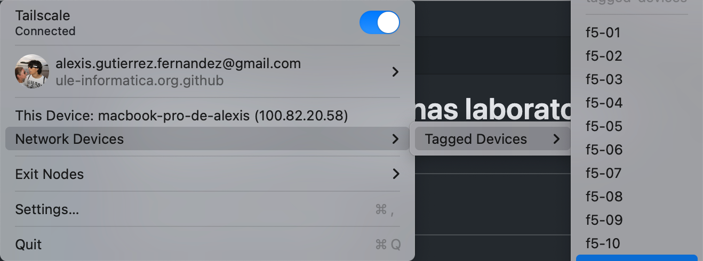

# Administración máquinas laboratorios F5/F6/G7/E5 - Ansible


## Descripción del sistema

### Tailscale - red de máquinas

### Máquinas incluidas en la instalación

Laboratorios F5, F6, E5 y G7

### Instalación inicial (ejemplo para máquina )
La instalación inicial está ya presente ya en todas las máquinas. La información relativa a la primera instalación se encuentra recogida en el directorio `disco`.

La configuración de `ansible`, `ansible-pull`, `ansible-playbook`, etc. está en el archivo `ansible.cfg` e incluye las rutas de los archivos de claves de acceso y de claves `ssh`, además del fichero que incluye los nombres de las máquinas que va a afectar (`inventory`).

### crontab
El `crontab` de cada máquina ejecuta cada hora un `ansible-pull` sobre el repositorio `https://github.com/mcasl/ansible.git` pasando como parámetro el archivo `local.yml`. Se aconseja incluir en este archivo los archivos yaml del directorio `tasks`. 

### Contraseñas
La información contenida en el repositorio que está cifrada con `ansible` se puede descifrar con la contraseña contenida en `.ansible_vault_passwd` que se encuentra en el gestor de contraseñas del grupo.
La contraseña de administrador y de la cuenta `practicas` 

### Claves SSH
Existe un único par de claves ssh compartida entre todas las máquinas para facilitar el compartir archivos entre ellas. Las claves se copian desde el repositorio en las máquinas en la instalación inicial.


## Añadir un nuevo usuario

### Tailscale (VPN)

Lo primero que debe hacer un nuevo usuario del sistema es crear una cuenta en Tailsale y que un administrador de la organización `ule-informatica.org.github` (Camino o Manolo) le añada a la misma.

> :warning: **Administradores**: Recordad además de conceder acceso a la organización, configurar correctamente las etiquetas a las que el usuario tiene acceso (`tag:nodolab`).

El nuevo usuario debe instalar la aplicación de escritorio de Tailscale e iniciar sesión, seleccionando conectarse a la organización (Tailnet) `ule-informatica.org.github`. Cuando la VPN se encuentra correctamente conectada se debe visualizar lo siguiente en Tailscale (prestar especial atención al apartado Network Devices > Tagged Devices, ya que en él se deben visualizar todas las máquinas de la red).



### Ansible

El nuevo usuario debe instalar también Ansible ([https://docs.ansible.com/ansible/latest/installation_guide/intro_installation.html](https://docs.ansible.com/ansible/latest/installation_guide/intro_installation.html)).

Tras ello se recomienda crear un directorio `ansible` donde colocaremos los ficheros de configuración necearios para manejar adecuadamente la red (en esta guía utilizaremos `~/.ansible`). En este directorio colocaremos los siguientes ficheros con los permisos adecuados:

1. El fichero [ansible.cfg.example](ansible.cfg.example) lo colocaremos en `~/.ansible/` renombrándolo a `ansible.cfg` con permisos `644`.
2. El fichero [hosts(hosts)] lo colocaremos en `~/.ansible/` manteniendo su nombre y con permisos `644`.
3. Crear un nuevo fichero llamado `passwd_f5.txt` en el directorio `~/.ansible/` cuyo contenido debe ser una única línea con la contraseña de administración de los equipos.
4. El fichero `~/.ansible/ansible.cfg` del paso 1 se encuentra configurado para utilizar el fichero `~/.ansible_vault_passwd`. Solicitar este fichero a uno de los administradores del sistema y, una vez colocado en el directorio, asegurarse de que tiene los permisos `644`.
5. El par de claves SSH utilizadas se debe solicitar a uno de los administradores del sistema. Una vez obtenidas, se deben colocar en `~/.ssh/ansible/` y configurar la pública con permisos `644` y al privada con permisos `600`.

Tras completar todos los pasos anteriores el usuario debería haber completado la configuración de Ansible.

Para ejecutar comandos de Ansible y que se coja la configuración que acabamos de realizar nos colocaremos en la carpeta donde hayamos metido los ficheros anteriores (en el ejemplo `~/.ansible`) y para probar que todo funciona correctamente podemos ejecutar un comando básico en todas las máquinas como por ejemplo:

```
$ ansible all -a "ls" -f 20 -o
```


## Instalación de nuevos paquetes

Para programar la instalación de nuevos paquetes se debe añadir el nombre del paquete al final del fichero `tasks/paquetes_apt.yml`

A continuación podemos esperar a la siguiente ejecución del cron para su ejecución, o forzarla con `ansible-pull -U https://github.com/mcasl/ansible_dimia.git local.yml`

## Instalación de nuevas aplicaciones no empaquetadas

La instalación de software que NO sea a través de apt requiere la creación de un nuevo fichero `yaml` que refleje el proceso completo (ver `anaconda.yml`). 